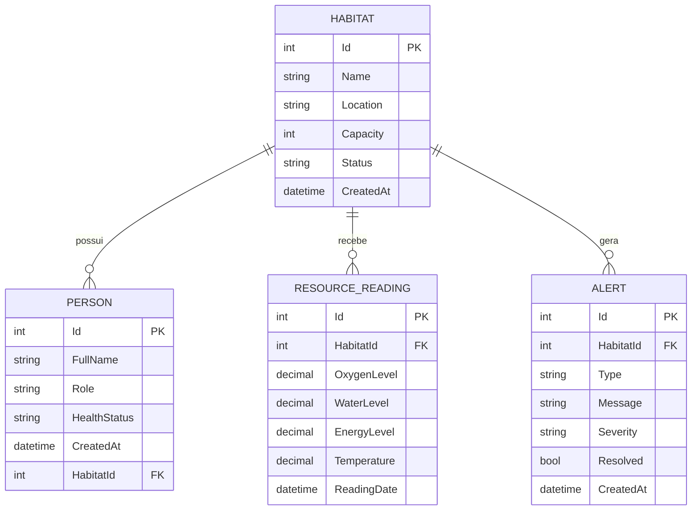

# AresLife API 🚀

API REST desenvolvida em **ASP.NET Core** para simular a gestão de habitats espaciais em cenários de colonização de Marte, exploração lunar e turismo espacial.

O projeto foi desenvolvido para a disciplina **Advanced Business Development with .NET**, atendendo aos requisitos de API REST, boas práticas de arquitetura, persistência em banco de dados relacional, relacionamento entre entidades e uso correto de migrations.

---

## Sumário

* [Sobre o projeto](#sobre-o-projeto)
* [Problema apresentado](#problema-apresentado)
* [Solução proposta](#solução-proposta)
* [Viabilidade e inovação](#viabilidade-e-inovação)
* [Tecnologias utilizadas](#tecnologias-utilizadas)
* [Arquitetura do projeto](#arquitetura-do-projeto)
* [Estrutura de pastas](#estrutura-de-pastas)
* [Modelagem do banco de dados](#modelagem-do-banco-de-dados)
* [Diagrama ER](#diagrama-er)
* [Relacionamentos implementados](#relacionamentos-implementados)
* [Exclusão de dados relacionados](#exclusão-de-dados-relacionados)
* [Regras de negócio](#regras-de-negócio)
* [Migrations](#migrations)
* [Como executar o projeto](#como-executar-o-projeto)
* [Endpoints da API](#endpoints-da-api)
* [Exemplos de testes](#exemplos-de-testes)
* [Tratamento de entradas inválidas](#tratamento-de-entradas-inválidas)
* [Demonstração ponta a ponta](#demonstração-ponta-a-ponta)
* [Como o projeto atende aos requisitos da disciplina](#como-o-projeto-atende-aos-requisitos-da-disciplina)
* [Vídeos da entrega](#vídeos-da-entrega)
* [Roteiro sugerido para vídeo demonstração](#roteiro-sugerido-para-vídeo-demonstração)
* [Roteiro sugerido para pitch](#roteiro-sugerido-para-pitch)
* [Integrantes](#integrantes)
* [Link do repositório](#link-do-repositório)
* [Status do projeto](#status-do-projeto)

---

## Sobre o projeto

O **AresLife** é uma API REST criada para simular o controle de habitats espaciais. A aplicação permite cadastrar habitats, registrar pessoas, monitorar recursos essenciais e gerar alertas automáticos quando algum recurso atinge níveis críticos.

O sistema simula desafios reais de futuras missões espaciais, como:

* controle de oxigênio;
* controle de água;
* controle de energia;
* monitoramento de temperatura;
* cadastro de astronautas, turistas e profissionais;
* geração de alertas de segurança;
* consulta de dashboard geral da operação.

A proposta foi pensada para ser simples, funcional e aplicável dentro dos requisitos da disciplina, sem deixar de apresentar uma solução criativa e conectada ao tema da economia espacial.

---

## Problema apresentado

Com o avanço da economia espacial, surgem novos desafios relacionados à colonização da Lua, colonização de Marte e crescimento do turismo espacial.

Futuras missões precisarão lidar com:

* sobrevivência humana em ambientes extremos;
* controle de recursos limitados;
* monitoramento remoto da saúde e segurança;
* logística e gestão de habitats espaciais;
* tomada de decisão rápida em situações críticas.

Além disso, soluções pensadas para ambientes espaciais também podem gerar aplicações úteis na Terra, principalmente em locais remotos, hospitais de campanha, áreas isoladas, operações emergenciais e regiões com infraestrutura limitada.

---

## Solução proposta

A solução proposta é a **AresLife API**, uma plataforma de simulação de habitats espaciais.

A API permite:

* cadastrar habitats espaciais;
* cadastrar pessoas vinculadas aos habitats;
* registrar leituras de oxigênio, água, energia e temperatura;
* gerar alertas automáticos quando uma leitura estiver em nível crítico;
* consultar alertas por habitat;
* resolver alertas;
* visualizar um dashboard com resumo geral da operação.

A proposta utiliza tecnologia, dados e infraestrutura digital para simular problemas reais de sobrevivência e gestão em ambientes extremos.

---

## Viabilidade e inovação

O projeto é viável porque foi desenvolvido como uma API REST funcional, utilizando tecnologias consolidadas no mercado, como ASP.NET Core, Entity Framework Core e SQLite.

A inovação está na aplicação do sistema em um contexto de economia espacial, simulando a gestão de habitats de Marte, exploração lunar e turismo espacial.

Mesmo sendo uma simulação, a lógica do projeto pode ser aplicada em problemas reais da Terra, como:

* monitoramento de bases remotas;
* controle de recursos em hospitais de campanha;
* apoio a operações de resgate;
* gestão de ambientes isolados;
* monitoramento de estruturas críticas;
* automação de alertas em locais com recursos limitados.

Dessa forma, o projeto conecta exploração espacial com necessidades reais de tecnologia, dados, monitoramento e segurança.

---

## Tecnologias utilizadas

* **C#**
* **ASP.NET Core Web API**
* **Entity Framework Core**
* **SQLite**
* **Swagger**
* **Migrations**
* **Git**
* **GitHub**

---

## Arquitetura do projeto

O projeto foi organizado em camadas, seguindo boas práticas de separação de responsabilidades.

A arquitetura foi escolhida para facilitar manutenção, testes, evolução do sistema e adição de novas funcionalidades.

### Camadas utilizadas

* **Controllers:** recebem as requisições HTTP e expõem os endpoints da API.
* **Models:** representam as entidades principais do banco de dados.
* **DTOs:** definem os dados recebidos nas requisições, evitando expor diretamente os Models.
* **Data:** contém o `DbContext`, responsável pela comunicação com o banco.
* **Service:** concentra regras de negócio, como a geração automática de alertas.
* **Migrations:** registra as alterações realizadas na estrutura do banco de dados.

Essa separação melhora a organização do código e permite que cada parte do sistema tenha uma responsabilidade clara.

---

## Estrutura de pastas

```txt
AresLife.Api/
├── Controllers/
│   ├── AlertsController.cs
│   ├── DashboardController.cs
│   ├── HabitatsController.cs
│   ├── PeopleController.cs
│   └── ResourceReadingsController.cs
│
├── Data/
│   └── AresLifeDbContext.cs
│
├── DTOs/
│   ├── AlertResponseDto.cs
│   ├── HabitatCreateDto.cs
│   ├── PersonCreateDto.cs
│   └── ResourceReadingCreateDto.cs
│
├── Migrations/
│   ├── InitialCreate.cs
│   └── AresLifeDbContextModelSnapshot.cs
│
├── Models/
│   ├── Alert.cs
│   ├── Habitat.cs
│   ├── Person.cs
│   └── ResourceReading.cs
│
├── Properties/
│   └── launchSettings.json
│
├── Service/
│   ├── AlertService.cs
│   └── DashboardService.cs
│
├── .gitignore
├── appsettings.json
├── appsettings.Development.json
├── AresLife.Api.csproj
├── AresLife.Api.http
├── Program.cs
└── README.md
```

---

## Modelagem do banco de dados

O banco foi modelado com a entidade **Habitat** como centro do sistema.

A partir dela, o sistema se relaciona com:

* pessoas cadastradas no habitat;
* leituras de recursos do habitat;
* alertas gerados para o habitat.

Essa modelagem representa uma base espacial em funcionamento, onde todos os dados operacionais estão conectados ao habitat monitorado.

---

## Diagrama ER



---

## Explicação do diagrama

O diagrama mostra que a tabela **Habitat** é a entidade principal do projeto.

Cada habitat pode possuir várias pessoas, várias leituras de recursos e vários alertas. Por isso, os relacionamentos implementados são do tipo **1:N**, ou seja, um registro de Habitat pode estar relacionado a vários registros de outras tabelas.

Esse modelo foi escolhido porque representa bem a realidade de uma base espacial. Uma única base pode ter vários tripulantes, receber várias leituras de sensores ao longo do tempo e gerar vários alertas operacionais.

---

## Relacionamentos implementados

O projeto possui três relacionamentos principais:

| Relacionamento            | Tipo | Justificativa                                       |
| ------------------------- | ---- | --------------------------------------------------- |
| Habitat → Person          | 1:N  | Um habitat pode ter várias pessoas cadastradas      |
| Habitat → ResourceReading | 1:N  | Um habitat pode receber várias leituras de recursos |
| Habitat → Alert           | 1:N  | Um habitat pode gerar vários alertas                |

Esses relacionamentos atendem ao requisito da disciplina de possuir pelo menos um relacionamento **1:N** ou **N:N** em banco de dados relacional.

---

## Exclusão de dados relacionados

O projeto utiliza regras diferentes para exclusão de dados relacionados:

* **People:** exclusão restrita. Um habitat não deve ser removido se houver pessoas vinculadas a ele.
* **ResourceReadings:** exclusão em cascata. As leituras pertencem ao histórico do habitat.
* **Alerts:** exclusão em cascata. Os alertas também pertencem ao histórico do habitat.

Essa decisão evita a perda acidental de dados importantes de pessoas cadastradas, mas mantém o histórico técnico do habitat vinculado à sua existência.

---

## Regras de negócio

A principal regra de negócio do projeto está na geração automática de alertas.

Quando uma leitura de recursos é cadastrada, o sistema verifica os valores informados e gera alertas caso algum recurso esteja em nível crítico.

### Regras de alerta

| Recurso     | Condição                          | Tipo de alerta | Severidade |
| ----------- | --------------------------------- | -------------- | ---------- |
| Oxigênio    | Menor que 19%                     | Oxygen         | Critical   |
| Água        | Menor que 25%                     | Water          | High       |
| Energia     | Menor que 30%                     | Energy         | High       |
| Temperatura | Menor que -40°C ou maior que 50°C | Temperature    | Critical   |

Exemplo:

Se uma leitura for cadastrada com oxigênio em 17%, água em 20%, energia em 25% e temperatura em -45°C, o sistema gera automaticamente alertas para cada recurso crítico.

Essa funcionalidade demonstra o uso de regras de negócio e tomada de decisão automática a partir de dados.

---

## Migrations

O projeto utiliza **Migrations** do Entity Framework Core.

Migrations são arquivos que registram as alterações feitas na estrutura do banco de dados. Elas permitem criar, versionar e atualizar tabelas de forma controlada, sem precisar alterar o banco manualmente.

A migration inicial do projeto foi:

```txt
InitialCreate
```

Ela foi responsável por criar as tabelas:

* Habitats
* People
* ResourceReadings
* Alerts
* __EFMigrationsHistory

### Comando utilizado para criar a migration

```bash
dotnet ef migrations add InitialCreate
```

### Comando utilizado para aplicar a migration no banco

```bash
dotnet ef database update
```

### Como gerenciar mudanças futuras no banco

Caso seja necessário adicionar uma nova funcionalidade que altere o banco, como monitoramento de radiação, o processo seria:

1. Alterar ou criar um Model.
2. Atualizar o DbContext, se necessário.
3. Criar uma nova migration com nome descritivo.
4. Aplicar a migration no banco.
5. Testar os novos endpoints.

Exemplo:

```bash
dotnet ef migrations add AddRadiationMonitoring
dotnet ef database update
```

---

## Como executar o projeto

### Pré-requisitos

Antes de executar, é necessário ter instalado:

* .NET SDK 8
* Git
* Editor de código, como Visual Studio Code
* Ferramenta do Entity Framework Core

Caso a ferramenta do Entity Framework não esteja instalada, execute:

```bash
dotnet tool install --global dotnet-ef
```

Ou, caso já esteja instalada:

```bash
dotnet tool update --global dotnet-ef
```

---

### 1. Clonar o repositório

```bash
git clone LINK_DO_REPOSITORIO
```

Exemplo:

```bash
git clone https://github.com/SEU-USUARIO/AresLife.Api.git
```

---

### 2. Entrar na pasta do projeto

```bash
cd AresLife.Api
```

---

### 3. Restaurar os pacotes

```bash
dotnet restore
```

---

### 4. Aplicar as migrations

```bash
dotnet ef database update
```

---

### 5. Executar a API

```bash
dotnet run
```

---

### 6. Acessar o Swagger

Após executar o projeto, acesse no navegador:

```txt
http://localhost:5273/swagger
```

Caso a porta seja diferente, utilize a porta exibida no terminal após o comando `dotnet run`.

---

## Endpoints da API

### Habitats

| Método | Endpoint             | Descrição                |
| ------ | -------------------- | ------------------------ |
| GET    | `/api/Habitats`      | Lista todos os habitats  |
| GET    | `/api/Habitats/{id}` | Busca um habitat por ID  |
| POST   | `/api/Habitats`      | Cadastra um novo habitat |
| PUT    | `/api/Habitats/{id}` | Atualiza um habitat      |
| DELETE | `/api/Habitats/{id}` | Remove um habitat        |

---

### People

| Método | Endpoint           | Descrição               |
| ------ | ------------------ | ----------------------- |
| GET    | `/api/People`      | Lista todas as pessoas  |
| GET    | `/api/People/{id}` | Busca uma pessoa por ID |
| POST   | `/api/People`      | Cadastra uma pessoa     |
| PUT    | `/api/People/{id}` | Atualiza uma pessoa     |
| DELETE | `/api/People/{id}` | Remove uma pessoa       |

---

### ResourceReadings

| Método | Endpoint                                     | Descrição                        |
| ------ | -------------------------------------------- | -------------------------------- |
| GET    | `/api/resource-readings`                     | Lista todas as leituras          |
| GET    | `/api/resource-readings/{id}`                | Busca uma leitura por ID         |
| GET    | `/api/resource-readings/habitat/{habitatId}` | Lista leituras por habitat       |
| POST   | `/api/resource-readings`                     | Cadastra uma leitura de recursos |

---

### Alerts

| Método | Endpoint                          | Descrição                      |
| ------ | --------------------------------- | ------------------------------ |
| GET    | `/api/Alerts`                     | Lista todos os alertas         |
| GET    | `/api/Alerts/{id}`                | Busca um alerta por ID         |
| GET    | `/api/Alerts/habitat/{habitatId}` | Lista alertas por habitat      |
| PUT    | `/api/Alerts/{id}/resolve`        | Marca um alerta como resolvido |

---

### Dashboard

| Método | Endpoint         | Descrição                          |
| ------ | ---------------- | ---------------------------------- |
| GET    | `/api/Dashboard` | Retorna um resumo geral do sistema |

---

## Exemplos de testes

Os testes podem ser realizados pelo Swagger, acessando:

```txt
http://localhost:5273/swagger
```

---

### 1. Criar habitat

**Endpoint:**

```txt
POST /api/Habitats
```

**Body:**

```json
{
  "name": "Ares-01",
  "location": "Mars - Valles Marineris",
  "capacity": 8,
  "status": "Active"
}
```

**Resultado esperado:**

```txt
201 Created
```

---

### 2. Listar habitats

**Endpoint:**

```txt
GET /api/Habitats
```

**Resultado esperado:**

A API retorna a lista de habitats cadastrados.

---

### 3. Cadastrar pessoa

**Endpoint:**

```txt
POST /api/People
```

**Body:**

```json
{
  "fullName": "Marina Magalhães",
  "role": "Commander",
  "healthStatus": "Stable",
  "habitatId": 1
}
```

**Resultado esperado:**

```txt
201 Created
```

---

### 4. Registrar leitura normal

**Endpoint:**

```txt
POST /api/resource-readings
```

**Body:**

```json
{
  "habitatId": 1,
  "oxygenLevel": 22,
  "waterLevel": 60,
  "energyLevel": 75,
  "temperature": -20
}
```

**Resultado esperado:**

A leitura é cadastrada sem geração de alertas críticos.

---

### 5. Registrar leitura crítica

**Endpoint:**

```txt
POST /api/resource-readings
```

**Body:**

```json
{
  "habitatId": 1,
  "oxygenLevel": 17,
  "waterLevel": 20,
  "energyLevel": 25,
  "temperature": -45
}
```

**Resultado esperado:**

A leitura é cadastrada e o sistema gera alertas automaticamente.

Exemplo de resposta esperada:

```json
{
  "reading": {
    "id": 1,
    "habitatId": 1,
    "oxygenLevel": 17,
    "waterLevel": 20,
    "energyLevel": 25,
    "temperature": -45
  },
  "generatedAlerts": [
    {
      "type": "Oxygen",
      "severity": "Critical"
    },
    {
      "type": "Water",
      "severity": "High"
    },
    {
      "type": "Energy",
      "severity": "High"
    },
    {
      "type": "Temperature",
      "severity": "Critical"
    }
  ]
}
```

---

### 6. Consultar alertas

**Endpoint:**

```txt
GET /api/Alerts
```

**Resultado esperado:**

A API retorna os alertas gerados pelo sistema.

---

### 7. Consultar alertas por habitat

**Endpoint:**

```txt
GET /api/Alerts/habitat/1
```

**Resultado esperado:**

A API retorna os alertas vinculados ao habitat informado.

---

### 8. Resolver alerta

**Endpoint:**

```txt
PUT /api/Alerts/{id}/resolve
```

**Exemplo:**

```txt
PUT /api/Alerts/1/resolve
```

**Resultado esperado:**

```txt
204 No Content
```

Após isso, o alerta passa a aparecer como:

```json
"resolved": true
```

---

### 9. Consultar dashboard

**Endpoint:**

```txt
GET /api/Dashboard
```

**Exemplo de retorno:**

```json
{
  "totalHabitats": 1,
  "totalPeople": 1,
  "totalReadings": 1,
  "totalAlerts": 4,
  "criticalAlerts": 2,
  "status": "Attention required"
}
```

---

## Tratamento de entradas inválidas

A aplicação trata entradas inválidas utilizando validações nos DTOs e Models.

Foram utilizadas validações como:

* `[Required]`
* `[MaxLength]`
* `[Range]`

Essas validações impedem que dados obrigatórios sejam enviados vazios ou fora dos limites esperados.

### Exemplo de entrada inválida

**Endpoint:**

```txt
POST /api/Habitats
```

**Body inválido:**

```json
{
  "name": "",
  "location": "Mars",
  "capacity": 0,
  "status": "Active"
}
```

**Resultado esperado:**

```txt
400 Bad Request
```

Essa resposta mostra que a API rejeita dados inválidos antes de salvar no banco.

---

## Demonstração ponta a ponta

Para demonstrar a aplicação funcionando de ponta a ponta, o seguinte fluxo pode ser executado:

1. Executar a API com `dotnet run`.
2. Acessar o Swagger.
3. Cadastrar um habitat.
4. Cadastrar uma pessoa vinculada ao habitat.
5. Registrar uma leitura normal.
6. Registrar uma leitura crítica.
7. Verificar os alertas gerados automaticamente.
8. Resolver um alerta.
9. Consultar o dashboard.
10. Testar uma entrada inválida e verificar o retorno `400 Bad Request`.

Esse fluxo demonstra:

* funcionamento da API REST;
* persistência em banco relacional;
* relacionamento entre entidades;
* uso de migrations;
* aplicação de regra de negócio;
* tratamento de erros;
* teste das rotas pelo Swagger.

---

## Como o projeto atende aos requisitos da disciplina

| Requisito                                  | Como foi atendido                                                                         |
| ------------------------------------------ | ----------------------------------------------------------------------------------------- |
| API REST e/ou MVC                          | Foi criada uma API REST com ASP.NET Core                                                  |
| Boas práticas de programação / arquitetura | O projeto foi separado em Controllers, Models, DTOs, Data, Service e Migrations           |
| Persistência em banco relacional           | Foi utilizado SQLite com Entity Framework Core                                            |
| Relacionamento 1:N ou N:N                  | Foram implementados relacionamentos 1:N entre Habitat e People, ResourceReadings e Alerts |
| Uso correto da Migration                   | Foi criada e aplicada a migration InitialCreate                                           |
| Viabilidade e inovação                     | A solução simula habitats espaciais e conecta o tema com problemas reais da Terra         |
| Documentação GitHub                        | Este README apresenta diagramas, desenvolvimento, testes e instruções de execução         |
| Exemplos de testes                         | Foram documentados exemplos de requisições e resultados esperados                         |
| Vídeo demonstração                         | Link disponível na seção de vídeos                                                        |
| Vídeo pitch                                | Link disponível na seção de vídeos                                                        |

---

## Vídeos da entrega

### Vídeo demonstração da solução completa

Tempo máximo: 8 minutos.

Link: **INSERIR LINK DO VÍDEO DEMONSTRAÇÃO AQUI**

---

### Vídeo pitch

Tempo máximo: 3 minutos.

Link: **INSERIR LINK DO VÍDEO PITCH AQUI**

---

## Integrantes

* Felipe Maglio Filho - RM: 563512
* João Pedro Bitencourt Goldoni - RM: 564339
* Marina Magalhães - RM: 561786
* Mateus Granja dos Santos - RM: 564930
* Vitória Valentina Maglio - RM: 563509

---
